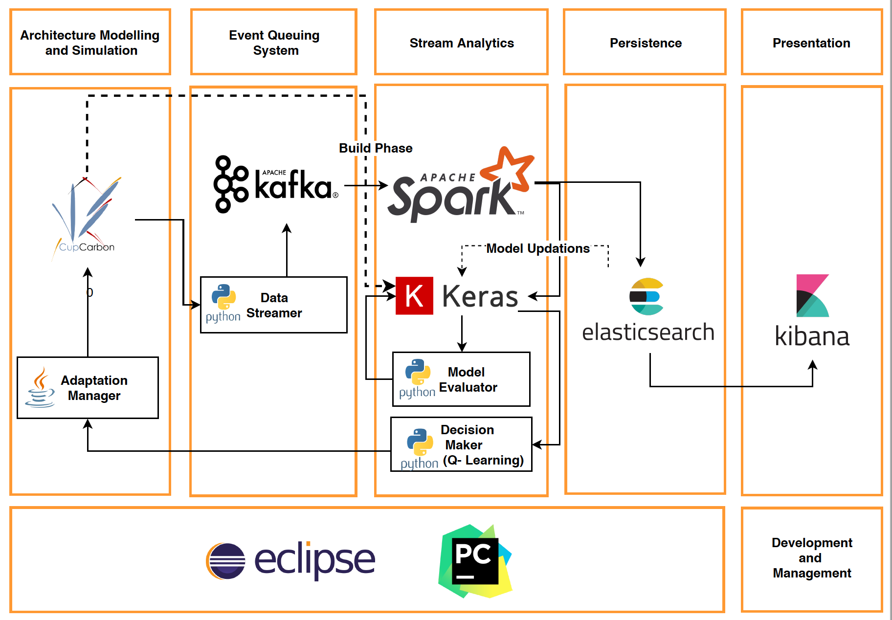

This is the repository of the approach which provides a way to architect self-adaptive IoT systems using a combination of machine learning and reinforcement learning techniques.

The overall implementation view is as follows:

## Project Content Description
1.  *CupCarbon-master* contains the modified source code of cupcarbon. The application can be started by running *cupcarbon.java*
2.  CupCarbon_Adapter contains the cupCarbon project of the case study mentioned in the paper. It can be opened by opening the Cup_Adapter.cup filefrom the 
    *open project* option available in the cupCarbon UI. Further details can be found in [www.cupcarbon.com](url)
    The natevents folder contains the sensor datasets used which was generated using a Poisson Distibution
3.  The data folder contains the different datasets used for experimentation and evaluations
        1.  *adap_energy_data.csv* and *adap_traffic.csv* contains the aggregated energy and traffic data simulated for a period of 10 days
        2.  *aggregated_energy_co.csv*, *aggregated_energy_su.csv* and *aggregated_energy_sc.csv* contains the aggregated energy of *co,su and sc* patterns respectively. These form the validation energy datasets
        3.  *aggregated_traffic_CO_day.csv,aggregated_traffic_SU_day.csv,aggregated_traffic_SC_day.csv* represents the real-time simulation aggregated traffic data for the period of 1 day for patterns co, su and sc respectively
        4.  *aggregated_energy_CO_day.csv,aggregated_energy_SU_day.csv,aggregated_traffic_SC_day.csv* represents the real-time simulation aggregated energy data for the period of 1 day for patterns co, su and sc respectively
        5.  *aggregated_energy_rl_day.csv* and *aggregated_traffic_rl_day.csv* contains the traffic and energy data generated by the reinforcement learning algorithm by using the approach
4.  *model* folder contains the machine learning models developed using Keras for energy and data traffi consumption. model1_master.h5 and model1_master.json represents
        the LSTM models for energy forecasting and *model1_master_traffic.h5* and *model1_master_traffic.json* represents the data traffic forecsating models
5.  *CupCarbon_Controller.py* and *CupCarbon_Traffic_Streamer.py* streams the real-time energy and data traffic logs respectively during CupCarbon project execution to Kafka
6.  *Initializer.py* is a class file and is responsible for initalizing the preliminary configuirations
7.  *LSTM_Learner_Vector_Out.py* and *LSTM_Traffic_Predictor.py* generates the energy and data traffic models respectively
8.  *Spark_Streamer.py* does a batch processing of the log information obtained from kafka and performes the real-time forecasts and decision making
9.  *Spark_Predictor.py* is a class file. It is repsobibel for loading the machine leanring modela dnd performing real-time machine learning. This also exeutes the deciion maker algorithm
10. *data_collector.py* and *data_collector_traffic.py* are part of the feature extractor and they perform aggregationg of the raw energy as well as the data traffic logs
       data logs obtained from cupCarbon so as to aid the model building process
11. *Spark_Predictor.py* contains the adaptation executor part, The $REMOTE_PATH$ variable needs to be replaced with the remote address of your system hosting CupCarbon
12. *settings.conf* contains the inital configurations required for all programs and this is inturn read and processed by Initalizer.py

## Installation Requirements
1. Install Apache Kafka  - [https://kafka.apache.org/quickstart](url)
2. Install kafka-python -[https://pypi.org/project/kafka-python/](url)
3. Install Keras in Python -[https://keras.io](url)
4. Install Apache Spark - [https://intellipaat.com/tutorial/spark-tutorial/downloading-spark-and-getting-started/](url)
5. Install PySpark - [https://medium.com/@GalarnykMichael/install-spark-on-ubuntu-pyspark-231c45677de0](url)

## Instructions
1. Run the CupCarbon from the modified source code
2. Open the *Cup_Adapter* project from the *open project* option in cupCarbon UI
3. Set the simulation parameters in cupCabron to one day and run the Simulation
4. Immidiately run the programs *CupCarbon_Controller.py* and *CupCarbon_Traffic_Streamer.py*
5. Start the spark stremaing context by running the following command inside the project folder : spark-submit --packages org.apache.spark:spark-streaming-kafka-0-8_2.11:2.4.0 Spark_Streamer.py
6. If there are no errors, the program keeps running till the simulation stops and we will be able to see the rewards being assinged depending on the forecasts and state of the system
